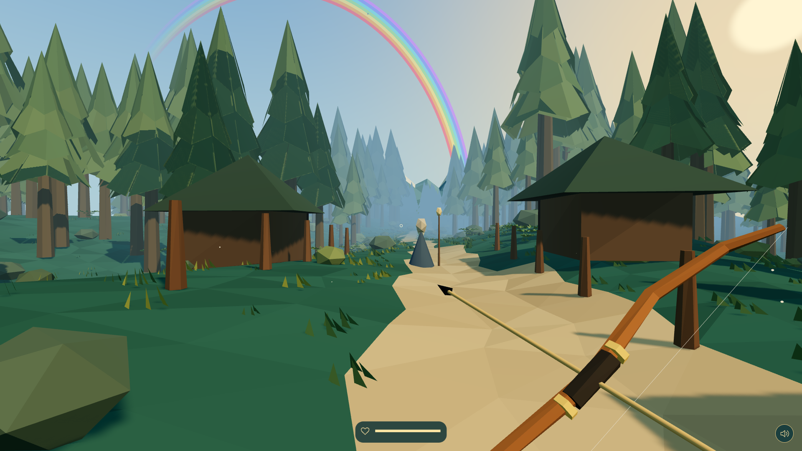
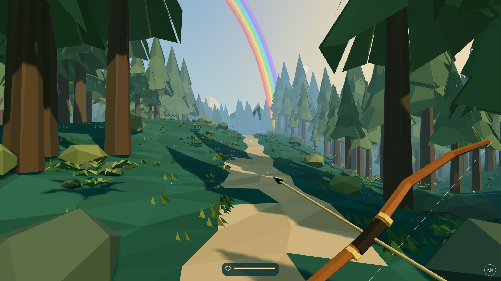
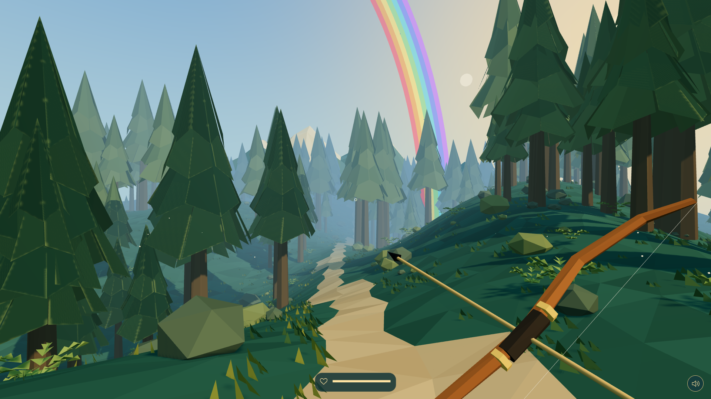
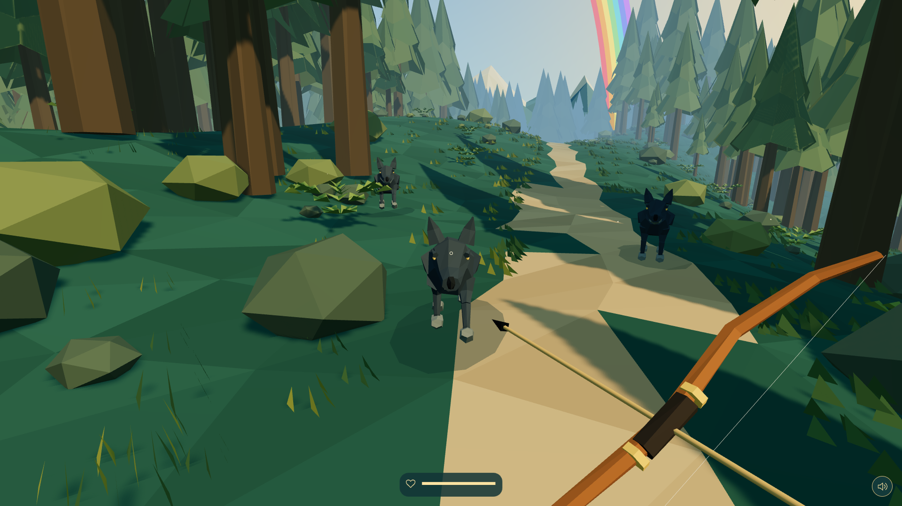
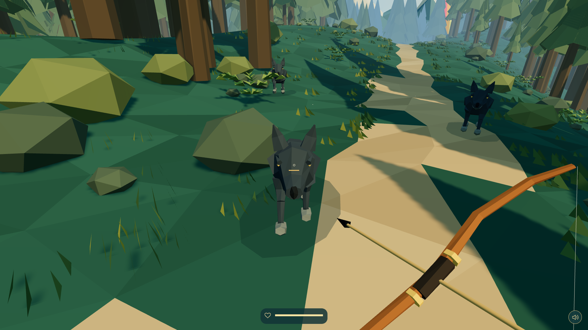
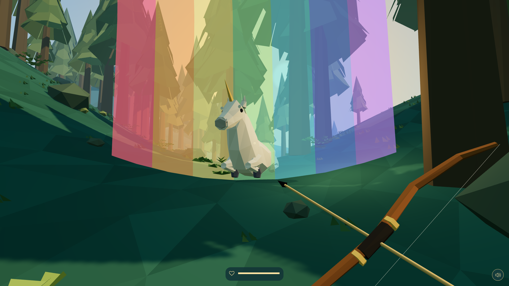
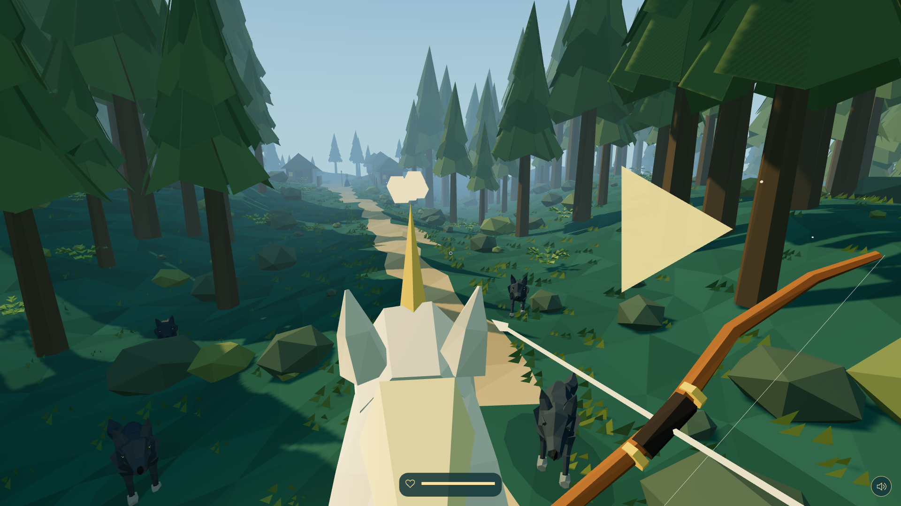
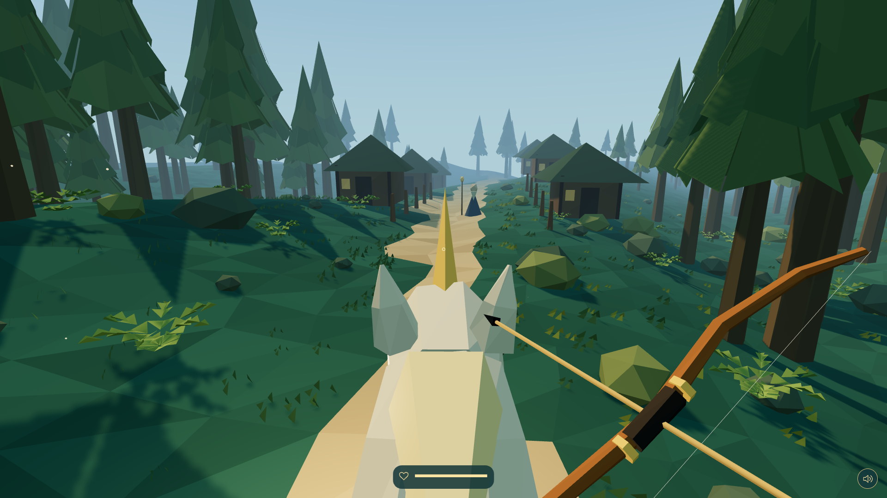

# The Horde

Follow a rainbow into the forest, find the ancient unicorn, and ride her home while wolves close in around you. The Horde is a first-person WebXR archery adventure made for js13kGames 2026.

Your journey begins with the village elder and a bow. Beyond the houses, the trail winds through a forest of pines, rocks and mist. Finding the unicorn is only the first half of the rescue: you still have to survive the ride back.

[The journey](#the-journey) · [How to play](#how-to-play) · [Development](#development) · [Build and checks](#build-and-checks)

## The journey

### 1. Speak with the elder

Walk up to the elder waiting on the village path. He tells you that the ancient unicorn needs help and gives you a clue: find where the rainbow ends. Listen to his warning about the wolves; when the conversation ends, he gives you your bow.



### 2. Follow the rainbow into the forest

Leave the village and explore on foot. The winding trail leads between tall pines, over slopes and into misty hollows. Look up for the rainbow, then head toward its end to find the unicorn's clearing. Her resting place changes between runs.

You can walk or teleport as you search. If you stray too far from the playable forest, the game brings you back to the trail so you can continue your journey.

| Follow the rainbow | Explore deeper into the woods |
| --- | --- |
|  |  |

### 3. Fight your way past the wolves

Wolves begin hunting you as you venture farther into the forest. Watch their approach, draw your bow and release before they reach you. Pulling the string farther sends the arrow faster; each bite takes away some of your health, and losing all of it ends the run.

Keep a clear line of sight: tree trunks, houses and the ground stop arrows. In VR, you can also thrust the arrow in your right hand at a wolf that gets too close.

| Wolves closing in | Draw, aim and release |
| --- | --- |
|  |  |

### 4. Find the ancient unicorn

At the rainbow's end, the unicorn is resting in a clearing. Approach her and she rises to meet you. Once she is standing, you automatically mount: your view lifts into the saddle and the journey home begins.



### 5. Ride through the horde

The unicorn follows the route home automatically, leaving you free to look around and use your bow. When you reach the main trail, two packs of wolves catch up on either side. Some run alongside you; others overtake, circle ahead and charge. A yellow chevron warns you which side the nearest threat is on.

New pursuers arrive as others fall, so keep watching the flanks and the path ahead all the way back. Arrows stop at the first wolf they hit. Shots into tree trunks, houses and the ground remain embedded, with the shaft visible. Up to 32 arrows stay in the scene; the oldest are removed as you shoot more, and restarting clears them all.



### 6. Bring her home

The wolves retreat as you approach the village. Ride between the houses to complete the rescue. You automatically dismount and turn toward the elder while the unicorn continues farther into the village.

He thanks you for bringing her back, then the scene fades out and the run ends. Press a controller trigger to start another journey.



## How to play

The game is designed for a WebXR headset with two tracked controllers, such as Quest-style controllers. Click the welcome screen to enter VR. After leaving VR, click again to resume.

| Action | VR control |
| --- | --- |
| Walk before mounting | Left stick |
| Turn in steps | Right stick left or right |
| Teleport before mounting | Push the right stick forward, then release |
| Nock an arrow | Bring the right hand close to the left hand and hold the right trigger |
| Draw and shoot | Separate your hands while holding the trigger, then release it |
| Strike at close range | Thrust the arrow in your right hand forward while not drawing |
| Advance a completed line of dialogue | Press a controller trigger |
| Restart after a run | Press a controller trigger |

The local desktop version uses mouse and keyboard. Its controls are listed under [Desktop development controls](#desktop-development-controls).

## Development

Use Node.js 24, matching [.nvmrc](.nvmrc), and install the project dependencies:

```sh
nvm use
npm ci
npm run dev
```

Open `http://localhost:4174` and click the welcome screen. A VR-capable browser requests immersive VR; a desktop development session starts with mouse controls. The server uses port `4174` by default; set `PORT` to use another port.

Desktop controls and test hooks are available in development. The contest release is WebXR-only and removes them.

### Desktop development controls

| Action | Control |
| --- | --- |
| Look around | Mouse |
| Walk before mounting | WASD or ZQSD |
| Draw and shoot | Hold the left mouse button, then release |
| Advance a completed line of dialogue | Left click |
| Teleport forward before mounting | Space |
| Pause or resume | Escape; click the welcome screen to recapture the mouse |
| Mute or unmute | M or the sound button |
| Restart after a run | Enter |

Development shortcuts let you jump to a scene without replaying the whole journey:

| Key | Shortcut |
| --- | --- |
| 1 | Restart at the village |
| 2 | Start on the forest road with the bow |
| 3 | Start beside the unicorn |
| 4 | Complete the unicorn's rise and mount, once she has begun rising |

## Build and checks

Install `zip` and `advzip` (from the `advancecomp` package) for release compression. On macOS, `advzip` can be installed with `brew install advancecomp`.

```sh
npm run build
npm test
```

Keep `npm run dev` running in a separate terminal for the browser checks. The checks use Playwright's Chromium and Firefox browsers; if the binaries are missing, install them with `npx playwright install chromium firefox`.

`npm run build` writes `dist/torde.zip`, containing one `index.html`. The archive keeps its existing filename even though the game is titled The Horde. The build enforces the 13,312-byte limit and fails before replacing the existing release if the new ZIP is too large. `dist/build.json` records the measured size and Roadroller settings of the most recent successful build.

The final archive imports the official js13k WebXR Three.js module:

```js
import * as T from 'https://play.js13kgames.com/2026/webxr/three.js';
```

No other game assets are loaded remotely. Packed browser tests serve an exact local copy of the official engine because the contest CDN blocks cross-origin imports from `localhost`. Use `npm run dev` for local play.

Individual checks are also available:

```sh
npm run test:ride
npm run test:reinforcements
npm run test:ending
npm run test:ride:packed
```

### Compression

Release builds use the audited parameters in [tools/roadroller-options.json](tools/roadroller-options.json), ES2021/module minification and compact game-owned properties. Readable field names and diagnostic counters remain in the development source. The final ZIP is measured after `zip -X -9` and `advzip`.

To search for better Roadroller settings:

```sh
npm run find-best-roadroller -- 300
```

This searches for five minutes using the exact current release input, starting from the saved settings. It compares the five best estimated candidates as real ZIPs against the existing settings, tests a smaller winner in Chromium/WebXR and Firefox, then saves its profile for the next build. Keep `npm run dev` running for these browser checks.

If sources or settings change during the search, the candidate is kept separately and the settings are preserved. The release in `dist/` stays untouched until `npm run build`. Add `--dry-run` to preserve the settings too, or `--variant packed` to search the JavaScript-only alternative. Ctrl-C stops the search and still compares the retained candidates. Inputs, archives and reports are saved in `.dream-loop/roadroller-search/`.

### Return encounter tuning

The return maintains two packs of five wolves. Attackers stage about 15 metres ahead before charging; reinforcements start 28 metres behind and catch up in about ten seconds. Kills slightly slow their staggered arrival, with at most two seconds between spawns. After biting, wolves pause for 3.5 seconds before rejoining the pursuit. They retreat before the village.

The final dismount, turn toward the elder, farewell and fade take about eleven seconds and pause with the game.

### Test on Quest

Connect a Quest over USB, authorize debugging on the headset and make `adb` available. Deployment requires Node.js 24.

`npm run quest:deploy` builds a fresh VR-only test copy and installs it on the connected headset. It embeds the official engine for offline testing. `npm run build` followed by `npm run quest:deploy -- --release` installs a test copy of the compressed release with the same embedded engine. The deployment report in `.dream-loop/quest/deploy-report.json` records the source build and verified hash.

## Screenshots and submission artwork

The eight screenshots in [screenshots/](screenshots/) are PNGs at 1920×1080, captured from the local desktop version. Test shortcuts were used to reach locations, place wolves and choose capture moments. The images show the actual game rendering without graphical retouching; [captures.json](screenshots/captures.json) records the game state for each shot.

- [Cover](media/cover.png) — PNG, 800×500, under 256 KB.
- [Thumbnail](media/thumbnail.png) — PNG, 320×320, under 64 KB.

## Repository hygiene

Generated builds, playtest outputs, old backups, source references and image-optimization work files are ignored. They remain available locally but are intentionally absent from a clean source commit. The screenshots and submission artwork are kept separately for documentation and presentation.
